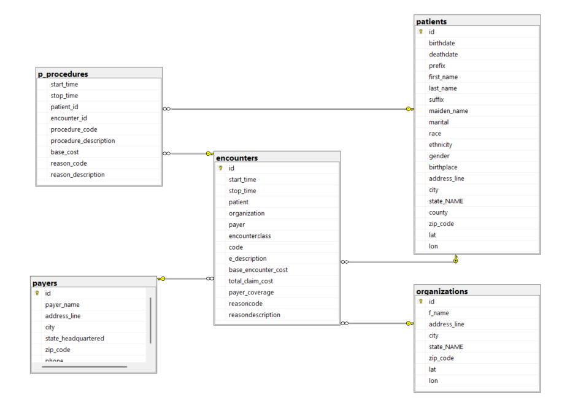

# Healthcare Patient & Encounter Analytics Using SQL Server

## Project Overview

This project analyzes hospital patient records using SQL Server.

The analysis focuses on:
- Hospital encounter trends
- Patient behavior analysis
- Insurance coverage insights
- Procedure cost analysis
- Readmission analysis

The project demonstrates advanced SQL concepts including:
- Joins
- LAG
- CTEs
- Window Functions 
- CASE Statements
- Relational Database Design
---
# Dataset
Dataset Source: Maven Analytics - Hospital Patient Records

Tables Used:
- Patients
- Encounters
- Procedures
- Organizations
- Payers

## Database Schema

---
# Business Questions Solved

## Operational Analysis
- How many encounters occurred each year?
- What percentage of encounters belonged to each encounter class?
- What percentage of encounters lasted over 24 hours?

## Financial & Insurance Analysis
- What percentage of encounters had no payer coverage?
- Which procedures had the highest average costs?
- What were the most frequently performed procedures?
- What is the average claim cost by payer/insurance company?

## Patient Behavior Analysis
- How many unique patients were admitted each quarter?
- Which patients were readmitted within 30 days?
- Which patients had the highest readmission counts?
---
# Key Insights

- Ambulatory encounters represented the majority of hospital visits.
- Several encounters had zero payer coverage, highlighting self-funded treatments.
- Certain medical procedures showed significantly higher average costs.
- Readmission analysis identified patients returning within 30 days.
- Encounter volume trends varied across years and encounter classes.
